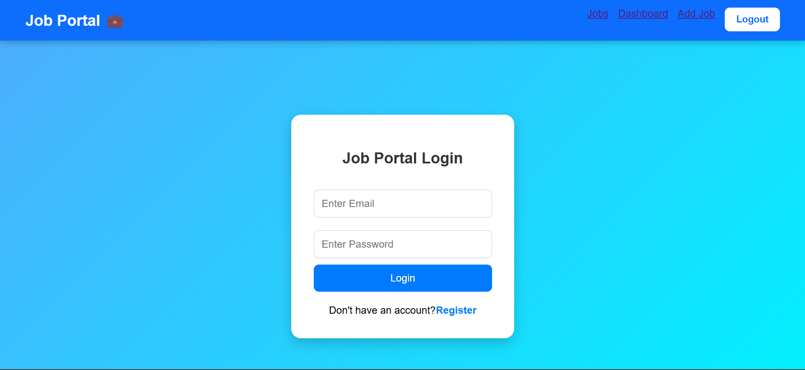
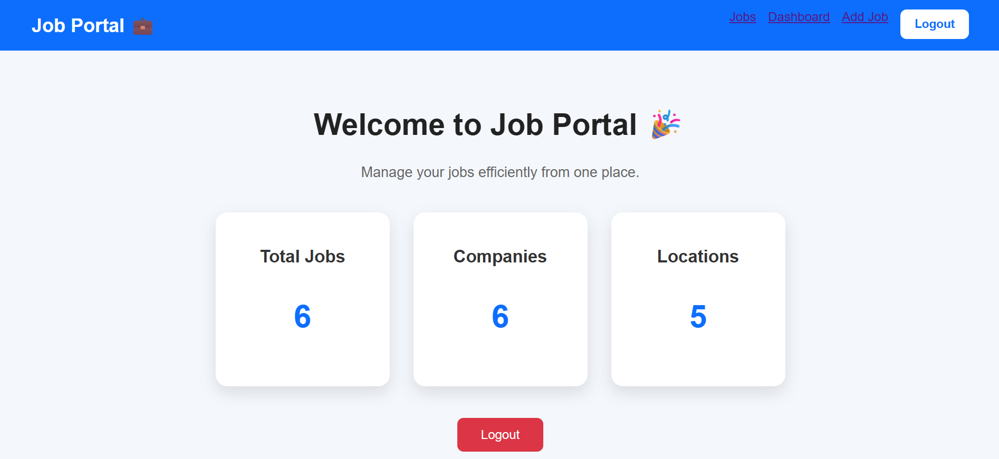
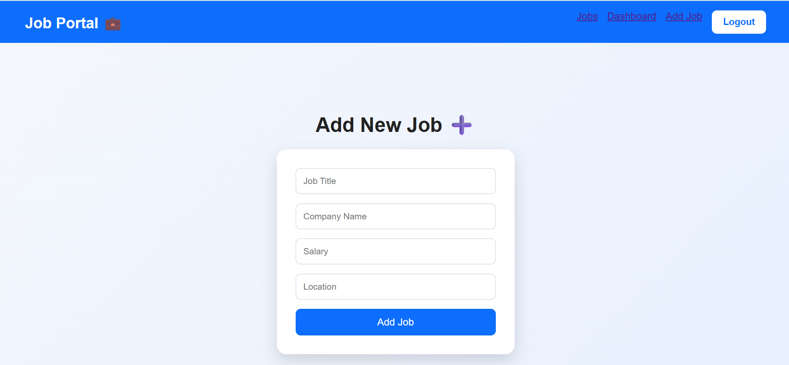
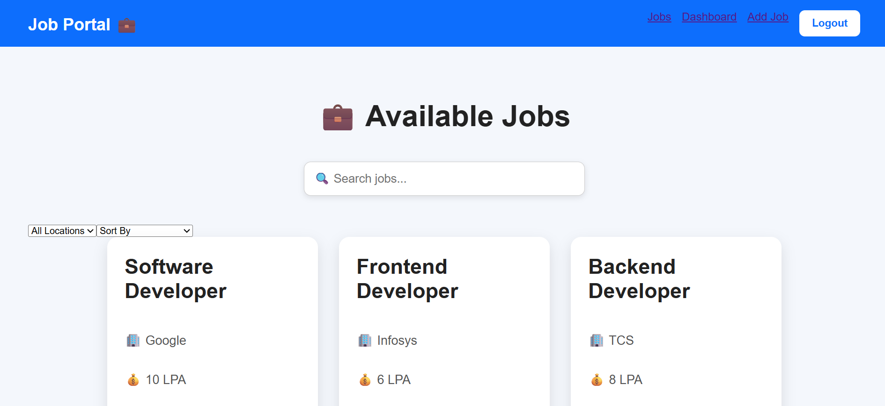
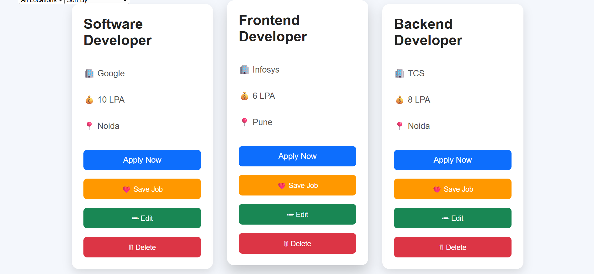
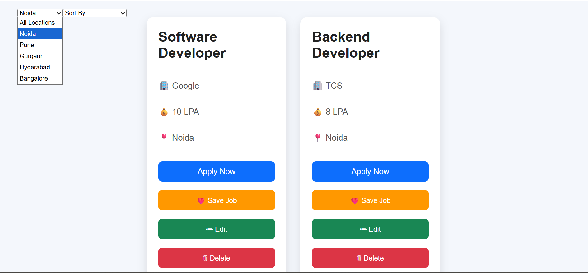
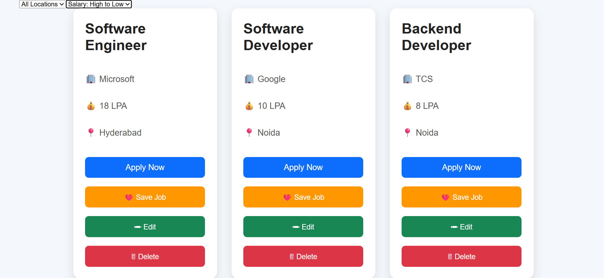

# Job Portal Web Application 🚀

A full-stack Job Portal application where users can register, login, add jobs, manage jobs, save jobs, and explore opportunities with sorting features.

## 🌐 Live Demo

Frontend:
https://job-portal-1-hmnb.onrender.com

Backend:
https://job-portal-weft.onrender.com

## ✨ Features

- User Registration and Login
- JWT Authentication
- Protected Dashboard
- Add New Jobs
- View Available Jobs
- Edit Jobs
- Delete Jobs
- Save Jobs
- Apply Now Feature
- Job Sorting:
  - Location based sorting
  - Salary Low to High
  - Salary High to Low
  - Company A-Z sorting
- Dashboard Analytics:
  - Total Jobs
  - Total Companies
  - Total Locations

## 🛠️ Tech Stack

### Frontend
- React.js
- React Router
- CSS

### Backend
- Node.js
- Express.js

### Database
- MySQL (Aiven Cloud)

### Deployment
- Render

## 📂 Project Structure
- job_portal
  │
  ├── backend
  │ ├── server.js
  │ ├── routes
  │ └── database files
  │
  └── frontend
  ├── src
  ├── public
  └── package.json

  

## 🔐 Authentication

The application uses JWT authentication for secure user login and protected routes.

## 📊 Dashboard

The dashboard provides real-time statistics:
- Number of jobs
- Number of companies
- Number of locations

## 📸 Screenshots

### Login Page

### Dashboard

### Add Job Page

### Jobs Page

### Jobs Listing

### Job Sorting Based on Location

### Job Sorting Based on Salary

## 👨‍💻 Author

Saksham Singhal

B.Tech Information Technology

  
